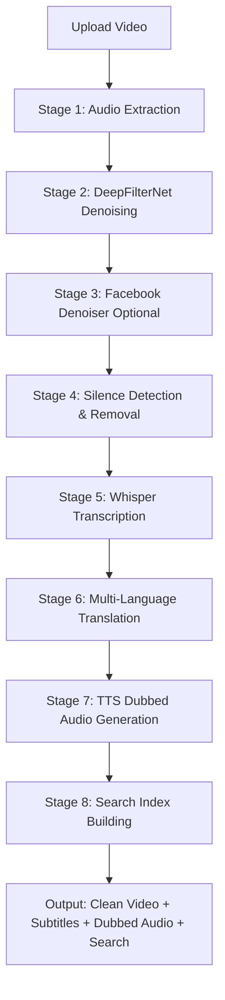

# 🎬 AI Video Processing & Multilingual Transcription System

> **Professional AI-powered video processing pipeline with noise removal, silence trimming, multi-language transcription, dubbed audio generation, keyword-based search, and AI-powered Q&A**

This comprehensive system processes videos through multiple AI stages: removes background noise, trims silence, transcribes speech, translates to 12+ languages, generates time-synchronized dubbed audio tracks, enables keyword-based subtitle search, and provides intelligent Q&A and video summaries—all through a modern web interface.


---

## 📋 Table of Contents

- [Features](#-features)
- [Demo](#-demo)
- [System Requirements](#-system-requirements)
- [Installation](#-installation)
- [Quick Start](#-quick-start)
- [Project Structure](#-project-structure)
- [How It Works](#-how-it-works)
- [Configuration Options](#-configuration-options)
- [API Documentation](#-api-documentation)
- [Troubleshooting](#-troubleshooting)
- [Performance Tips](#-performance-tips)
- [Credits](#-credits)

---

## ✨ Features

### 🎯 **Core Video Processing**
- ✅ **AI-Powered Noise Removal** - DeepFilterNet3 neural network for stationary noise
- ✅ **Optional Enhanced Denoising** - Facebook Denoiser (DNS64) for superior quality
- ✅ **Automatic Silence Detection & Removal** - Trims dead air automatically
- ✅ **Perfect Audio-Video Sync** - Maintains frame-perfect synchronization
- ✅ **GPU Acceleration** - CUDA support for 3-5x faster processing

### 🌍 **Multilingual Transcription & Translation**
- ✅ **Speech-to-Text Transcription** - OpenAI Whisper AI model
- ✅ **12+ Language Support** - English, Hindi, Kannada, Tamil, Telugu, Malayalam, Marathi, Bengali, Gujarati, Punjabi, Odia, Urdu
- ✅ **Auto-Translation** - Google Translate integration for all languages
- ✅ **WebVTT Subtitles** - Standard subtitle format with timestamps
- ✅ **Time-Synchronized Dubbed Audio** - gTTS with FFmpeg time-stretching for perfect lip-sync
- ✅ **Multi-Track Audio** - YouTube-style language switching with audio + subtitles

### 🔍 **Smart Search & Indexing**
- ✅ **Keyword-Based Search** - Search spoken words across all language tracks
- ✅ **Full-Text Context** - Returns complete sentences, not just timestamps
- ✅ **Multi-Language Search** - Search in any transcribed language
- ✅ **JSON Indexing** - Fast word-to-timestamp mapping
- ✅ **VTT Cue Matching** - Retrieves full context from subtitle files

### 🤖 **AI-Powered Q&A & Summary** (NEW!)
- ✅ **Video Summaries** - AI-generated comprehensive overviews
- ✅ **Key Points Extraction** - Automatic identification of main takeaways
- ✅ **Minute-by-Minute Breakdown** - Timeline of video content
- ✅ **Interactive Q&A** - Ask questions about video content
- ✅ **Timestamp Queries** - "What did they say at minute 5?"
- ✅ **Context-Aware Responses** - AI references specific video moments
- ✅ **Groq Llama 3.3 70B** - State-of-the-art language model
- ✅ **Full-Text Context** - Returns complete sentences, not just timestamps
- ✅ **Multi-Language Search** - Search in any transcribed language
- ✅ **JSON Indexing** - Fast word-to-timestamp mapping
- ✅ **VTT Cue Matching** - Retrieves full context from subtitle files

### 🎨 **Modern User Interface**
- 🌐 **Advanced Web Interface** - Beautiful, responsive design with video player
- 📊 **Real-time Statistics** - Duration, silence %, time saved, processing status
- 🎬 **Before/After Comparison** - Side-by-side video playback
- 🎵 **Interactive Language Tracks** - Click to switch subtitles + dubbed audio
- 🔄 **Perfect Audio Sync** - Play/pause/seek synchronization like YouTube
- 📱 **Mobile Friendly** - Works on phones and tablets

### ⚙️ **Technical Features**
- 🚀 **FastAPI Backend** - High-performance async REST API
- 🔧 **Configurable Processing** - CPU/GPU toggle, quality options, language selection
- 📦 **Automatic Cleanup** - Removes temporary files after processing
- 🎯 **Multiple Format Support** - MP4, AVI, MOV, MKV input formats
- 💾 **Efficient Storage** - Organized outputs, subtitles, audio tracks, search indexes

---

## 🎥 Demo

**Complete Processing Pipeline:**
1. **Upload Video** → Choose MP4/AVI/MOV/MKV file
2. **AI Noise Removal** → DeepFilterNet3 + optional Facebook Denoiser
3. **Silence Trimming** → Removes dead air segments
4. **Speech Transcription** → Whisper AI extracts spoken text
5. **Multi-Language Translation** → Google Translate to 12+ languages
6. **Dubbed Audio Generation** → gTTS with time-stretching for perfect sync
7. **Search Indexing** → Keyword-based search across all languages
8. **Compare & Download** → Original vs processed with language tracks

**Example Results:**
- **Original**: 120 seconds with background noise, no subtitles
- **Processed**: 95 seconds, crystal clear audio
- **Output**: 20% silence removed, professional quality
- **Transcription**: English + 11 translated languages with dubbed audio
- **Search**: Find any spoken word with timestamp + full context

**Use Cases:**
- 🎓 **Educational Content** - Lectures with multi-language subtitles + dubbed audio
- 🎤 **Podcast Processing** - Remove noise, trim silence, add transcripts
- 🎬 **Video Production** - Professional audio cleanup with translation
- 📹 **YouTube Content** - Multi-language support like official YouTube dubbing
- 🔍 **Video Search** - Find exact moments when specific words were spoken

---

## � Project Structure

```
NoiseRemoval/
├── 📄 README.md                    # Main documentation (this file)
├── 📄 SETUP.md                     # Installation guide
├── 📄 HANDOVER.md                  # Project handover summary
├── 📄 CHANGELOG.md                 # Version history
├── 📄 LICENSE                      # MIT License
├── 📄 requirements.txt             # Python dependencies (CPU)
├── 📄 requirements-gpu.txt         # Python dependencies (GPU)
├── 📄 .gitignore                   # Git ignore rules
│
├── 🌐 index.html                   # Basic web interface
├── 🌐 index_advanced.html          # Advanced interface with transcription
├── 🐍 deepfilternet_denoise.py     # Standalone CLI script
│
├── 📂 backend/                     # FastAPI backend
│   ├── app.py                      # Main API server (port 8001)
│   ├── process_video.py            # Video processing pipeline
│   ├── transcribe.py               # Whisper transcription + TTS generation
│   ├── vtt_utils.py                # WebVTT subtitle utilities
│   ├── search_index.py             # Keyword search indexing
│   ├── test_server.py              # API testing utilities
│   ├── __init__.py                 # Python module init
│   ├── README.md                   # Backend documentation
│   │
│   ├── uploads/                    # Temporary uploaded videos
│   │   └── .gitkeep
│   ├── outputs/                    # Processed videos
│   │   └── .gitkeep
│   ├── audio/                      # Generated dubbed audio tracks
│   │   └── {video_id}.{lang}.mp3  # Time-stretched TTS audio
│   ├── subtitles/                  # WebVTT subtitle files
│   │   ├── {video_id}.manifest.json      # Language metadata
│   │   ├── {video_id}.{lang}.vtt         # Subtitle track
│   │   └── {video_id}.{lang}.index.json  # Search index
│   └── transcripts/                # Raw transcription JSON
│       └── {video_id}.json         # Whisper output
│
├── 📂 noise/                       # Python virtual environment
│   ├── pyvenv.cfg                  # Virtual env config
│   ├── Scripts/                    # Python executables
│   │   ├── activate                # Unix activation
│   │   ├── activate.bat            # Windows activation
│   │   ├── Activate.ps1            # PowerShell activation
│   │   └── python.exe              # Python interpreter
│   ├── Lib/                        # Python packages
│   │   └── site-packages/          # Installed dependencies
│   │       ├── df/                 # DeepFilterNet
│   │       ├── denoiser/           # Facebook Denoiser
│   │       ├── whisper/            # OpenAI Whisper
│   │       ├── gtts/               # Google Text-to-Speech
│   │       ├── deep_translator/    # Translation library
│   │       └── ...                 # Other dependencies
│   ├── Include/                    # C headers
│   ├── share/                      # Shared resources
│   └── third_party/                # External tools
│       └── ffmpeg/                 # FFmpeg binaries
│           └── ffmpeg-8.0-essentials_build/
│               └── bin/
│                   ├── ffmpeg.exe  # Video processing
│                   └── ffprobe.exe # Media info
│
└── 📂 __pycache__/                 # Python cache (auto-generated)
```

### Key Files Explained

| File/Folder | Purpose |
|-------------|---------|
| `index_advanced.html` | Main web UI with video player, language tracks, search |
| `backend/app.py` | REST API server (FastAPI) on port 8001 |
| `backend/process_video.py` | Complete processing pipeline (noise → silence → transcribe) |
| `backend/transcribe.py` | Whisper transcription + translation + TTS audio generation |
| `backend/search_index.py` | Builds word→timestamp indexes for keyword search |
| `backend/vtt_utils.py` | WebVTT parsing and subtitle file handling |
| `backend/subtitles/` | All generated subtitle files (.vtt) + search indexes (.json) |
| `backend/audio/` | Time-synchronized dubbed audio tracks (.mp3) |
| `backend/transcripts/` | Raw Whisper transcription data (.json) |
| `deepfilternet_denoise.py` | Standalone CLI script for quick noise removal |
| `noise/` | Virtual environment with all AI models and dependencies |
| `requirements.txt` | CPU-only dependencies |
| `requirements-gpu.txt` | GPU-accelerated dependencies (CUDA) |

---

## 🏗️ System Architecture

### **High-Level Overview**

```
┌─────────────────────────────────────────────────────────────────┐
│                     USER INTERFACE (Frontend)                    │
│                      index_advanced.html                         │
│  ┌──────────────┐  ┌──────────────┐  ┌────────────────────┐   │
│  │ Video Upload │  │ Language     │  │ Keyword Search     │   │
│  │ & Settings   │  │ Track Picker │  │ with Context       │   │
│  └──────────────┘  └──────────────┘  └────────────────────┘   │
└─────────────────────────────────────────────────────────────────┘
                              │
                              │ HTTP REST API
                              ▼
┌─────────────────────────────────────────────────────────────────┐
│                  FASTAPI BACKEND (Port 8001)                     │
│                         backend/app.py                           │
│  ┌──────────────┐  ┌──────────────┐  ┌────────────────────┐   │
│  │ /upload      │  │ /download    │  │ /api/search        │   │
│  │ endpoint     │  │ endpoint     │  │ endpoint           │   │
│  └──────────────┘  └──────────────┘  └────────────────────┘   │
└─────────────────────────────────────────────────────────────────┘
                              │
                              │ Processing Pipeline
                              ▼
┌─────────────────────────────────────────────────────────────────┐
│                   VIDEO PROCESSING PIPELINE                      │
│                    backend/process_video.py                      │
│                                                                   │
│  Stage 1: Noise Removal (GPU/CPU)                               │
│  ┌────────────────┐         ┌──────────────────────┐           │
│  │ DeepFilterNet3 │────────▶│ Facebook Denoiser    │           │
│  │ (Stationary)   │         │ (Optional, Advanced) │           │
│  └────────────────┘         └──────────────────────┘           │
│                                      │                           │
│  Stage 2: Silence Detection          │                           │
│  ┌────────────────────────────────────▼───────────────────┐    │
│  │ FFmpeg silencedetect (-35dB, 1s minimum)              │    │
│  │ Output: Timestamps of silent segments                  │    │
│  └────────────────────────────────────┬───────────────────┘    │
│                                        │                         │
│  Stage 3: Video Trimming               │                         │
│  ┌────────────────────────────────────▼───────────────────┐    │
│  │ Cut video at silence boundaries (frame-perfect sync)   │    │
│  │ Concatenate non-silent segments                        │    │
│  └────────────────────────────────────┬───────────────────┘    │
│                                        │                         │
└────────────────────────────────────────┼───────────────────────┘
                                         │
                                         ▼
┌─────────────────────────────────────────────────────────────────┐
│                  TRANSCRIPTION & TRANSLATION                     │
│                     backend/transcribe.py                        │
│                                                                   │
│  Stage 4: Speech-to-Text (GPU/CPU)                              │
│  ┌────────────────────────────────────────────────────────┐    │
│  │ OpenAI Whisper "small" model                           │    │
│  │ Output: Timestamped segments with text                 │    │
│  └────────────────────────────────┬───────────────────────┘    │
│                                    │                             │
│  Stage 5: Multi-Language Translation                            │
│  ┌────────────────────────────────▼───────────────────────┐    │
│  │ Google Translate (deep-translator)                     │    │
│  │ Languages: en, hi, kn, ta, te, ml, mr, bn, gu, pa,    │    │
│  │            or, ur (12 total)                           │    │
│  └────────────────────────────────┬───────────────────────┘    │
│                                    │                             │
│  Stage 6: WebVTT Subtitle Generation                            │
│  ┌────────────────────────────────▼───────────────────────┐    │
│  │ backend/vtt_utils.py                                   │    │
│  │ Creates .vtt files with timestamps                     │    │
│  │ Output: {video_id}.{lang}.vtt                          │    │
│  └────────────────────────────────┬───────────────────────┘    │
│                                    │                             │
│  Stage 7: TTS Dubbed Audio Generation                           │
│  ┌────────────────────────────────▼───────────────────────┐    │
│  │ gTTS (Google Text-to-Speech)                           │    │
│  │ → Generate audio per segment                           │    │
│  │ → Calculate speed ratio (actual/target duration)       │    │
│  │ → FFmpeg atempo filter (time-stretching)               │    │
│  │ → Pad/trim to exact original duration                  │    │
│  │ Output: {video_id}.{lang}.mp3                          │    │
│  └────────────────────────────────┬───────────────────────┘    │
│                                    │                             │
└────────────────────────────────────┼───────────────────────────┘
                                     │
                                     ▼
┌─────────────────────────────────────────────────────────────────┐
│                    SEARCH INDEXING SYSTEM                        │
│                   backend/search_index.py                        │
│                                                                   │
│  Stage 8: Keyword Index Building                                │
│  ┌──────────────────────────────────────────────────────────┐  │
│  │ Parse VTT files → Extract words → Build inverted index  │  │
│  │ word → [timestamp1, timestamp2, ...]                     │  │
│  │ Output: {video_id}.{lang}.index.json                     │  │
│  └──────────────────────────────────────────────────────────┘  │
│                                                                   │
│  Search Query Processing:                                        │
│  ┌──────────────────────────────────────────────────────────┐  │
│  │ User keyword → Find timestamps in index                  │  │
│  │            → Load VTT file                               │  │
│  │            → Match timestamps to cues                    │  │
│  │            → Return full text context                    │  │
│  └──────────────────────────────────────────────────────────┘  │
└─────────────────────────────────────────────────────────────────┘
                              │
                              ▼
┌─────────────────────────────────────────────────────────────────┐
│                      FILE STORAGE SYSTEM                         │
│                                                                   │
│  backend/outputs/       → Processed videos (.mp4)               │
│  backend/subtitles/     → WebVTT files (.vtt) + indexes (.json) │
│  backend/audio/         → Dubbed audio tracks (.mp3)            │
│  backend/transcripts/   → Raw Whisper JSON (.json)              │
│  backend/uploads/       → Temporary uploads (auto-cleaned)      │
└─────────────────────────────────────────────────────────────────┘
```

### **Technology Stack**

| Layer | Technology | Purpose |
|-------|-----------|---------|
| **Frontend** | HTML5, CSS3, JavaScript | Video player, file upload, language switching |
| **API** | FastAPI, Uvicorn | REST API server, async request handling |
| **AI Models** | DeepFilterNet3, Facebook DNS64, OpenAI Whisper | Noise removal, speech recognition |
| **Translation** | Google Translate (deep-translator) | Text translation (12 languages) |
| **TTS** | gTTS (Google Text-to-Speech) | Dubbed audio generation |
| **Video Processing** | FFmpeg 8.0 | Audio extraction, silence detection, trimming, time-stretching |
| **Audio Processing** | Librosa, SoundFile, Pydub | Audio manipulation, format conversion |
| **Deep Learning** | PyTorch, CUDA | GPU acceleration for AI models |
| **Subtitle Format** | WebVTT | Standard subtitle format with timestamps |
| **Search** | Inverted index (JSON) | Fast keyword-based search |

### **Data Flow**

```
┌──────────────┐
│ User uploads │
│  video.mp4   │
└──────┬───────┘
       │
       ▼
┌────────────────────────────────────────────────────────────────┐
│ STEP 1: Video Processing (Noise + Silence Removal)            │
│ Input:  video.mp4 (120s, noisy audio)                         │
│ Output: video_clean_synced.mp4 (95s, clean audio)             │
│ Temp:   audio.wav → denoised.wav → silence_times.txt          │
└────────────────────────────────┬───────────────────────────────┘
                                 │
                                 ▼
┌────────────────────────────────────────────────────────────────┐
│ STEP 2: Transcription (English)                               │
│ Input:  video_clean_synced.mp4                                │
│ Output: transcript.json (timestamped segments)                 │
│ Model:  Whisper "small" (GPU/CPU)                             │
│                                                                 │
│ Example output:                                                 │
│ [                                                               │
│   {"start": 0.0, "end": 3.5, "text": "Hello everyone"},       │
│   {"start": 3.5, "end": 7.2, "text": "Welcome to the video"}  │
│ ]                                                               │
└────────────────────────────────┬───────────────────────────────┘
                                 │
                                 ▼
┌────────────────────────────────────────────────────────────────┐
│ STEP 3: Translation (12 languages)                            │
│ Input:  transcript.json (English)                              │
│ Output: 12 translated versions                                 │
│                                                                 │
│ English:  "Hello everyone"                                     │
│ Hindi:    "सभी को नमस्कार"                                   │
│ Kannada:  "ಎಲ್ಲರಿಗೂ ನಮಸ್ಕಾರ"                                │
│ Tamil:    "அனைவருக்கும் வணக்கம்"                              │
│ ... (9 more languages)                                         │
└────────────────────────────────┬───────────────────────────────┘
                                 │
                                 ▼
┌────────────────────────────────────────────────────────────────┐
│ STEP 4: WebVTT Subtitle Generation                            │
│ Input:  Translated segments                                    │
│ Output: video_id.en.vtt, video_id.hi.vtt, ... (12 files)      │
│                                                                 │
│ Example .vtt format:                                            │
│ WEBVTT                                                          │
│                                                                 │
│ 00:00:00.000 --> 00:00:03.500                                  │
│ Hello everyone                                                  │
│                                                                 │
│ 00:00:03.500 --> 00:00:07.200                                  │
│ Welcome to the video                                            │
└────────────────────────────────┬───────────────────────────────┘
                                 │
                                 ▼
┌────────────────────────────────────────────────────────────────┐
│ STEP 5: TTS Dubbed Audio Generation                           │
│ Input:  Translated text segments                               │
│ Output: video_id.hi.mp3, video_id.kn.mp3, ... (12 files)      │
│                                                                 │
│ For each segment:                                               │
│ 1. gTTS generates audio (e.g., "सभी को नमस्कार" → 2.1s)      │
│ 2. Target duration = 3.5s (from original timing)              │
│ 3. Speed ratio = 2.1 / 3.5 = 0.6                              │
│ 4. FFmpeg atempo=1.667 (stretch 2.1s → 3.5s)                  │
│ 5. Pad with silence if needed to exact duration               │
│ 6. Concatenate all segments → full dubbed track               │
└────────────────────────────────┬───────────────────────────────┘
                                 │
                                 ▼
┌────────────────────────────────────────────────────────────────┐
│ STEP 6: Search Index Building                                 │
│ Input:  All .vtt files                                         │
│ Output: video_id.en.index.json, video_id.hi.index.json, ...   │
│                                                                 │
│ Example index.json:                                             │
│ {                                                               │
│   "hello": [0.0, 45.2, 120.5],     // word appears at times   │
│   "everyone": [0.0, 67.3],                                     │
│   "welcome": [3.5, 89.1]                                       │
│ }                                                               │
└────────────────────────────────┬───────────────────────────────┘
                                 │
                                 ▼
┌────────────────────────────────────────────────────────────────┐
│ FINAL OUTPUT                                                   │
│                                                                 │
│ 1. Processed video: video_clean_synced.mp4                    │
│ 2. Original video:  video_original.mp4                        │
│ 3. Subtitles:       12 .vtt files (en, hi, kn, ta, ...)      │
│ 4. Dubbed audio:    12 .mp3 files (time-synchronized)        │
│ 5. Search indexes:  12 .index.json files                      │
│ 6. Manifest:        video_id.manifest.json (metadata)         │
│                                                                 │
│ User can now:                                                   │
│ - Watch processed video with clean audio                       │
│ - Switch between 12 language subtitle tracks                   │
│ - Listen to dubbed audio in any language (perfect sync)       │
│ - Search keywords and jump to exact moments                    │
└────────────────────────────────────────────────────────────────┘
```

---

## 💻 System Requirements

### **Minimum Requirements (CPU Mode)**
- **OS**: Windows 10/11, Linux, macOS
- **Python**: 3.8 or higher
- **RAM**: 8GB (16GB recommended)
- **Storage**: 5GB free space
- **CPU**: Multi-core processor (Intel i5/AMD Ryzen 5 or better)

### **Recommended (GPU Mode)**
- **GPU**: NVIDIA GPU with CUDA support (GTX 1060 or better)
- **CUDA**: CUDA Toolkit 11.8 or compatible
- **RAM**: 16GB+ (for Facebook Denoiser)
- **VRAM**: 6GB+ GPU memory

### **Software Prerequisites**
- Python 3.8+
- FFmpeg (included in project)
- Modern web browser (Chrome, Edge, Firefox)

---

## 📦 Installation

### **Step 1: Clone the Repository**

```bash
git clone https://github.com/Veereshamaragatti/NoiseRemoval.git
cd NoiseRemoval
```

### **Step 2: Set Up Python Virtual Environment**

**Windows (PowerShell):**
```powershell
python -m venv noise
.\noise\Scripts\Activate.ps1
```

**Linux/Mac:**
```bash
python3 -m venv noise
source noise/bin/activate
```

### **Step 3: Install Core Dependencies**

```bash
pip install --upgrade pip
pip install torch torchaudio --index-url https://download.pytorch.org/whl/cu118
```

> **Note**: For CPU-only (no CUDA):
> ```bash
> pip install torch torchaudio
> ```

### **Step 4: Install AI Models & Core Libraries**

```bash
# Core AI Models
pip install deepfilternet           # DeepFilterNet3 noise removal
pip install denoiser                # Facebook Denoiser (optional, advanced)
pip install openai-whisper          # OpenAI Whisper speech-to-text

# Translation & TTS
pip install deep-translator         # Google Translate integration
pip install gtts                    # Google Text-to-Speech

# Audio/Video Processing
pip install librosa soundfile pydub scipy numpy
pip install ffmpeg-python           # FFmpeg Python wrapper

# API & Web Framework
pip install fastapi uvicorn python-multipart
```

### **Step 5: Verify Installation**

```bash
# Check PyTorch and CUDA
python -c "import torch; print(f'PyTorch: {torch.__version__}'); print(f'CUDA Available: {torch.cuda.is_available()}')"

# Check AI Models
python -c "import df; print('DeepFilterNet: OK')"
python -c "import denoiser; print('Facebook Denoiser: OK')"
python -c "import whisper; print('OpenAI Whisper: OK')"

# Check Translation & TTS
python -c "from deep_translator import GoogleTranslator; print('Google Translate: OK')"
python -c "from gtts import gTTS; print('gTTS: OK')"

# Check Audio Libraries
python -c "import librosa; import soundfile; import pydub; print('Audio Libraries: OK')"
```

**Expected Output:**
```
PyTorch: 2.x.x+cu118
CUDA Available: True  # or False for CPU mode
DeepFilterNet: OK
Facebook Denoiser: OK
OpenAI Whisper: OK
Google Translate: OK
gTTS: OK
Audio Libraries: OK
```

---

## 🚀 Quick Start

### **1. Start the Backend Server**

```bash
cd backend
python app.py
```

**Expected Output:**
```
🚀 Starting FastAPI server...
📁 Upload directory: E:\NoiseRemoval\backend\uploads
📁 Output directory: E:\NoiseRemoval\backend\outputs
📁 Subtitle directory: E:\NoiseRemoval\backend\subtitles
📁 Audio directory: E:\NoiseRemoval\backend\audio
INFO:     Uvicorn running on http://0.0.0.0:8001
```

### **2. Open the Web Interface**

**Option A: Double-click** `index_advanced.html` in File Explorer

**Option B: Command line:**
```bash
# Windows
start index_advanced.html

# Linux
xdg-open index_advanced.html

# Mac
open index_advanced.html
```

### **3. Process Your First Video**

1. Click **"Choose Video File"**
2. Select a video (MP4, AVI, MOV, MKV)
3. Choose options:
   - ☐ **Use GPU** - Enable if you have NVIDIA GPU (3-5x faster)
   - ☐ **Use Facebook Denoiser** - Enable for best quality (needs 16GB RAM)
   - ☐ **Enable Transcription** - Generate subtitles and dubbed audio
   - **Select Languages** - Choose which languages to generate (English + 11 others)
4. Click **"Upload & Process Video"**
5. Wait for processing (may take 2-15 minutes depending on video length and options)
6. **View Results:**
   - Compare original vs processed videos
   - Click language buttons (🎵 icon) to switch subtitles + dubbed audio
   - Use search box to find keywords across all languages
   - Download the cleaned video

### **4. Using the Search Feature**

1. After processing completes, you'll see a search box
2. Type any keyword (e.g., "hello", "welcome", "introduction")
3. Search works across all generated language tracks
4. Results show:
   - Language the word was found in
   - Exact timestamp (clickable to jump to that moment)
   - Full sentence context (not just the word)
5. Click on a timestamp to jump to that exact moment in the video

---

## 🔧 How It Works

### **Complete Processing Pipeline (8 Stages)**



### **Detailed Process**

#### **Stage 1: Audio Extraction** 🎧
- Extracts audio track from uploaded video
- Converts to 16kHz mono WAV (optimized for AI models)
- Uses FFmpeg for reliable extraction
- Temporary file: `audio.wav`

#### **Stage 2: DeepFilterNet Denoising** 🤖
- **Model**: DeepFilterNet3 (state-of-the-art neural network)
- **Purpose**: Removes stationary noise (fan hum, AC, static, background buzz)
- **Method**: Trained on 10,000+ hours of noisy speech data
- **GPU/CPU**: Automatically uses CUDA if available
- **Output**: Significantly cleaner audio with preserved speech quality

#### **Stage 3: Facebook Denoiser** 🧠 *(Optional)*
- **Model**: DNS64 (Facebook Research)
- **Purpose**: Removes complex non-stationary noise (keyboard, mouse clicks, music)
- **Method**: Deep learning-based real-time denoising
- **Requirement**: ~7-16GB RAM depending on video length
- **Quality**: Superior results when enabled, professional-grade output
- **Note**: Skip this for long videos or if RAM limited

#### **Stage 4: Silence Detection & Removal** ✂️
- **Detection**: FFmpeg silencedetect filter
- **Threshold**: -35dB, 1 second minimum duration
- **Process**: 
  1. Identifies all silent segments with timestamps
  2. Cuts video at silence boundaries (frame-accurate)
  3. Concatenates non-silent segments
  4. Maintains perfect audio-video sync
- **Output**: Trimmed video with dead air removed, statistics on silence %

#### **Stage 5: Whisper Speech Transcription** 🎙️
- **Model**: OpenAI Whisper "small" (244M parameters)
- **Languages**: Auto-detects spoken language (supports 99 languages)
- **GPU/CPU**: Uses GPU if available (3-5x faster than CPU)
- **Process**:
  1. Segments audio into chunks
  2. Transcribes each segment with timestamps
  3. Outputs timestamped text segments
- **Output**: JSON with `[{start, end, text}, ...]`
- **Example**:
  ```json
  [
    {"start": 0.0, "end": 3.5, "text": "Hello everyone"},
    {"start": 3.5, "end": 7.2, "text": "Welcome to this video"}
  ]
  ```

#### **Stage 6: Multi-Language Translation** 🌍
- **Service**: Google Translate via deep-translator library
- **Languages Supported** (12 total):
  - English (en) - Original/Default
  - Hindi (hi) - हिंदी
  - Kannada (kn) - ಕನ್ನಡ
  - Tamil (ta) - தமிழ்
  - Telugu (te) - తెలుగు
  - Malayalam (ml) - മലയാളം
  - Marathi (mr) - मराठी
  - Bengali (bn) - বাংলা
  - Gujarati (gu) - ગુજરાતી
  - Punjabi (pa) - ਪੰਜਾਬੀ
  - Odia (or) - ଓଡ଼ିଆ
  - Urdu (ur) - اردو
- **Process**: Translates each text segment while preserving timestamps
- **Output**: 
  - WebVTT subtitle files: `{video_id}.{lang}.vtt`
  - Manifest file: `{video_id}.manifest.json` (language metadata)

#### **Stage 7: TTS Dubbed Audio Generation** 🎵
- **TTS Engine**: gTTS (Google Text-to-Speech)
- **Purpose**: Create time-synchronized dubbed audio tracks (like YouTube dubbing)
- **Process** (per language):
  1. **Generate TTS**: Create audio for each translated segment
  2. **Measure Duration**: Get actual TTS audio length (e.g., 2.1 seconds)
  3. **Calculate Speed Ratio**: Compare to original segment duration (e.g., 3.5s)
     - Speed ratio = 2.1s / 3.5s = 0.6
     - Need to stretch by 1.667x to match
  4. **Time-Stretch with FFmpeg**: Apply `atempo` filter
     - For ratios > 2.0x: Chain multiple filters (atempo max is 2.0)
     - Example: 3.5x = atempo=2.0,atempo=1.75
  5. **Pad/Trim**: Ensure exact duration match (±0.01s precision)
  6. **Concatenate**: Join all segments → full dubbed track
- **Output**: `{video_id}.{lang}.mp3` (one per language)
- **Sync**: Perfect frame-accurate synchronization with original video timing

#### **Stage 8: Search Index Building** 🔍
- **Purpose**: Enable fast keyword-based search across all language tracks
- **Process**:
  1. **Parse VTT Files**: Extract all words with timestamps
  2. **Build Inverted Index**: Create word → [timestamp1, timestamp2, ...] mapping
  3. **Normalize**: Convert to lowercase, remove punctuation
  4. **Store**: Save as JSON for fast lookup
- **Output**: `{video_id}.{lang}.index.json` (one per language)
- **Example Index**:
  ```json
  {
    "hello": [0.0, 45.2, 120.5],
    "everyone": [0.0, 67.3],
    "welcome": [3.5, 89.1, 154.2]
  }
  ```
- **Search Query**:
  1. User types "welcome"
  2. Lookup in index → finds [3.5, 89.1, 154.2]
  3. Load VTT file → match timestamps to cues
  4. Return full sentence context: "Welcome to this video"
  5. User clicks timestamp → video seeks to 3.5s

#### **Final Output** �
#### **Final Output** 📦
- **Processed Video**: Clean audio, silence removed, ready for playback
- **Original Video**: Preserved for comparison
- **Subtitle Files**: 12 WebVTT files (one per language)
- **Dubbed Audio Tracks**: 12 MP3 files (time-synchronized with video)
- **Search Indexes**: 12 JSON files (fast keyword lookup)
- **Manifest**: Metadata file with language information
- **Statistics**: Processing time, silence %, segments removed, file sizes

**User Experience:**
- Click language buttons to switch subtitles + dubbed audio instantly
- Search any word in any language → jump to exact moment
- Download processed video or individual subtitle/audio files
- Perfect sync like YouTube's multi-language feature

---

## ⚙️ Configuration Options

### **Processing Modes**

| Option | CPU Mode | GPU Mode | GPU + FB Denoiser |
|--------|----------|----------|-------------------|
| **Speed** | ⭐⭐ Slow | ⭐⭐⭐⭐⭐ Fast | ⭐⭐⭐⭐ Fast |
| **RAM Usage** | 4-8GB | 4-8GB | 12-16GB |
| **Quality** | ⭐⭐⭐⭐ Good | ⭐⭐⭐⭐ Good | ⭐⭐⭐⭐⭐ Excellent |
| **Requirements** | Any CPU | NVIDIA GPU | NVIDIA GPU + 16GB RAM |

### **When to Use Each Mode**

#### **CPU Mode (Default)** ✅
- ✅ No GPU available
- ✅ Limited RAM (8GB)
- ✅ Large videos (>100MB)
- ✅ Most reliable option

#### **GPU Mode** 🚀
- ✅ NVIDIA GPU with CUDA
- ✅ Faster processing (3-5x speed)
- ✅ Same quality as CPU
- ✅ Handles any video size

#### **GPU + Facebook Denoiser** 💎
- ✅ Best possible quality
- ✅ Complex noise environments
- ✅ Professional use cases
- ⚠️ Requires 16GB+ RAM
- ⚠️ May fail on large videos

---

## 📡 API Documentation

### **Base URL**
```
http://localhost:8001
```

### **Endpoints**

#### **1. Health Check**
```http
GET /
```

**Response:**
```json
{
  "status": "ok",
  "message": "AI Video Processing API is running"
}
```

---

#### **2. Upload & Process Video**
```http
POST /upload
Content-Type: multipart/form-data
```

**Request Body:**
- `file` (file): Video file to process
- `use_gpu` (boolean): Enable GPU acceleration (default: false)
- `use_facebook_denoiser` (boolean): Enable FB Denoiser (default: false)
- `enable_transcription` (boolean): Generate transcripts + dubbed audio (default: false)
- `languages` (string): Comma-separated language codes (e.g., "en,hi,kn,ta")

**Response:**
```json
{
  "status": "done",
  "output_file": "/download/uuid_clean_synced.mp4",
  "original_file": "/download/uuid_original.mp4",
  "statistics": {
    "original_duration": 120.5,
    "processed_duration": 95.2,
    "silence_removed_percent": 21.0,
    "segments_removed": 8
  },
  "transcription": {
    "en": {
      "vtt_url": "/subtitles/uuid.en.vtt",
      "audio_url": "/audio/uuid.en.mp3"
    },
    "hi": {
      "vtt_url": "/subtitles/uuid.hi.vtt",
      "audio_url": "/audio/uuid.hi.mp3"
    }
    // ... more languages
  },
  "message": "Video processed successfully with transcription"
}
```

**cURL Example:**
```bash
curl -X POST "http://localhost:8001/upload" \
  -F "file=@video.mp4" \
  -F "use_gpu=true" \
  -F "use_facebook_denoiser=false" \
  -F "enable_transcription=true" \
  -F "languages=en,hi,kn,ta,te"
```

---

#### **3. Download Processed Video**
```http
GET /download/{filename}
```

**Parameters:**
- `filename`: Name of the processed video file

**Response:** Video file (video/mp4)

**Example:**
```bash
curl -O "http://localhost:8001/download/uuid_clean_synced.mp4"
```

---

#### **4. Download Subtitle File**
```http
GET /subtitles/{filename}
```

**Parameters:**
- `filename`: Name of the VTT subtitle file (e.g., `uuid.hi.vtt`)

**Response:** WebVTT subtitle file (text/vtt)

**Example:**
```bash
curl -O "http://localhost:8001/subtitles/uuid.en.vtt"
```

---

#### **5. Download Dubbed Audio Track**
```http
GET /audio/{filename}
```

**Parameters:**
- `filename`: Name of the dubbed audio file (e.g., `uuid.kn.mp3`)

**Response:** MP3 audio file (audio/mpeg)

**Example:**
```bash
curl -O "http://localhost:8001/audio/uuid.kn.mp3"
```

---

#### **6. Search Subtitles by Keyword**
```http
GET /api/search?video_id={video_id}&query={keyword}&lang={language_code}
```

**Parameters:**
- `video_id`: Unique video identifier (UUID)
- `query`: Search keyword (e.g., "hello", "welcome")
- `lang`: Language code (e.g., "en", "hi", "kn") - optional, searches all if not provided

**Response:**
```json
{
  "query": "hello",
  "results": [
    {
      "language": "en",
      "timestamp": "00:00:00.000",
      "time_seconds": 0.0,
      "text": "Hello everyone, welcome to this video"
    },
    {
      "language": "hi",
      "timestamp": "00:00:00.000",
      "time_seconds": 0.0,
      "text": "सभी को नमस्कार, इस वीडियो में आपका स्वागत है"
    }
  ]
}
```

**Example:**
```bash
curl "http://localhost:8001/api/search?video_id=9938f777&query=hello&lang=en"
```

---

#### **7. Delete Video & Associated Files** *(Optional)*
```http
DELETE /cleanup/{video_id}
```

**Response:**
```json
{
  "status": "ok",
  "message": "Video uuid and all associated files deleted successfully"
}
```

---

## 🔧 Troubleshooting

### **Common Issues**

#### **1. "CUDA out of memory" Error**
**Problem:** GPU doesn't have enough VRAM

**Solution:**
```
✅ Uncheck "Use GPU" option
✅ Use CPU mode instead
✅ Process shorter videos
✅ Close other GPU applications
```

---

#### **2. "Not enough memory" Error**
**Problem:** System RAM exhausted (usually with Facebook Denoiser)

**Solution:**
```
✅ Uncheck "Use Facebook Denoiser"
✅ Close other applications
✅ Process shorter videos (split long videos)
✅ Restart your computer to free RAM
```

---

#### **3. "ffmpeg not found" Error**
**Problem:** FFmpeg executable not located

**Solution:**
```bash
# Verify FFmpeg path in process_video.py
# Should be: noise/third_party/ffmpeg/ffmpeg-8.0-essentials_build/bin/ffmpeg.exe

# Or install system-wide FFmpeg
# Windows: choco install ffmpeg
# Linux: sudo apt install ffmpeg
# Mac: brew install ffmpeg
```

---

#### **4. Server Won't Start**
**Problem:** Port 8001 already in use

**Solution:**
```bash
# Option 1: Kill process using port 8001
# Windows:
netstat -ano | findstr :8001
taskkill /PID <PID> /F

# Linux/Mac:
lsof -i :8001
kill -9 <PID>

# Option 2: Change port in app.py
# Line: uvicorn.run("app:app", host="0.0.0.0", port=8002)
```

---

#### **5. Video Upload Fails**
**Problem:** File too large or wrong format

**Solution:**
```
✅ Check file size (keep under 500MB for best results)
✅ Supported formats: .mp4, .avi, .mov, .mkv
✅ Check browser console for errors (F12)
✅ Try different video codec/format
```

---

#### **6. Models Not Downloading**
**Problem:** DeepFilterNet/Denoiser models fail to download

**Solution:**
```bash
# Manually download models
python -c "from df import init_df; init_df()"
python -c "from denoiser import pretrained; pretrained.dns64()"

# Check internet connection
# Check firewall settings
# Try using VPN if blocked
```

---

## 🚀 Performance Tips

### **For Faster Processing**

1. **Enable GPU** if available (3-5x faster)
2. **Keep videos under 5 minutes** for optimal speed
3. **Use 720p videos** instead of 4K (faster, same audio quality)
4. **Close other applications** to free resources
5. **Use SSD storage** for temp files

### **For Better Quality**

1. **Enable Facebook Denoiser** (if you have 16GB+ RAM)
2. **Use higher quality source videos**
3. **Ensure good microphone in original recording**
4. **Avoid heavily compressed videos**

### **For Large Videos**

1. **Split video into chunks** (use free video splitter)
2. **Process each chunk separately**
3. **Use CPU mode** (more memory efficient)
4. **Don't use Facebook Denoiser**

---

## 📊 Technical Specifications

### **AI Models Used**

| Model | Version | Size | Purpose | Training Data | GPU Support |
|-------|---------|------|---------|---------------|-------------|
| DeepFilterNet3 | 0.5.6 | ~5MB | Stationary noise removal | 10k+ hours speech | ✅ CUDA |
| Facebook DNS64 | Latest | ~50MB | Advanced denoising | Real-world noise samples | ✅ CUDA |
| OpenAI Whisper | small | ~461MB | Speech-to-text transcription | 680k hours multilingual | ✅ CUDA |
| Google Translate | API | N/A | Text translation | Web-scale corpus | ☁️ Cloud |
| gTTS | API | N/A | Text-to-speech synthesis | Google's TTS engine | ☁️ Cloud |

### **Audio Processing**

- **Sample Rate**: 16kHz (AI models) / 48kHz (original preservation)
- **Channels**: Mono (converted from stereo for processing)
- **Bit Depth**: 16-bit PCM
- **Formats**: WAV (intermediate), MP3 (dubbed audio), MP4 (final video)
- **Silence Threshold**: -35dB, 1 second minimum
- **Time-Stretching**: FFmpeg atempo filter (0.5x - 2.0x per filter, chainable)

### **Video Processing**

- **Codec**: H.264 (copy mode, no re-encoding for speed)
- **Container**: MP4 (universal compatibility)
- **Sync Method**: Frame-accurate timestamp matching (±0.01s precision)
- **Tool**: FFmpeg 8.0
- **Trimming**: Segment-based concatenation (lossless)

### **Subtitle System**

- **Format**: WebVTT (W3C standard)
- **Encoding**: UTF-8 (supports all Unicode languages)
- **Timestamps**: Millisecond precision (HH:MM:SS.mmm)
- **Languages**: 12 (English + 11 translations)
- **Search**: Inverted index (JSON) for O(1) keyword lookup

### **Performance Metrics**

| Operation | CPU Mode | GPU Mode (CUDA) | Speed Improvement |
|-----------|----------|-----------------|-------------------|
| DeepFilterNet | ~2-3 min/video | ~30-45 sec/video | 3-4x faster |
| Facebook Denoiser | ~3-4 min/video | ~45-60 sec/video | 3-4x faster |
| Whisper Transcription | ~5-8 min/video | ~1-2 min/video | 4-5x faster |
| Silence Detection | ~10-15 sec | ~10-15 sec | No difference |
| TTS Generation | ~20-30 sec/lang | ~20-30 sec/lang | No difference (cloud) |
| Total (all features) | ~15-25 min | ~4-7 min | **3-4x faster** |

*Based on 5-minute 1080p video with 12 language tracks on RTX 3060*

---

## 🎓 Credits & Acknowledgments

### **AI Models**
- **DeepFilterNet** - [Rikorose/DeepFilterNet](https://github.com/Rikorose/DeepFilterNet)
- **Facebook Denoiser** - [facebookresearch/denoiser](https://github.com/facebookresearch/denoiser)
- **OpenAI Whisper** - [openai/whisper](https://github.com/openai/whisper)

### **Translation & TTS**
- **Google Translate** - via [deep-translator](https://github.com/nidhaloff/deep-translator)
- **gTTS** - [pndurette/gTTS](https://github.com/pndurette/gTTS)

### **Libraries**
- **FastAPI** - Modern async web framework
- **PyTorch** - Deep learning framework
- **Librosa** - Audio analysis and processing
- **FFmpeg** - Video/audio processing Swiss Army knife
- **Pydub** - Simple audio manipulation
### **Libraries**
- **FastAPI** - Modern async web framework
- **PyTorch** - Deep learning framework
- **Librosa** - Audio analysis and processing
- **FFmpeg** - Video/audio processing Swiss Army knife
- **Pydub** - Simple audio manipulation

### **Author**
- **Veeresh Amaragatti** - [@Veereshamaragatti](https://github.com/Veereshamaragatti)

---

## 📄 License

This project is open source and available under the MIT License.

---

## 🤝 Support & Contributing

### **Getting Help**

1. **Check Documentation** - README.md, SETUP.md, HANDOVER.md
2. **Troubleshooting Section** - Common issues and solutions above
3. **Search Existing Issues** on GitHub
4. **Create New Issue** with details:
   - Error message and full traceback
   - System specs (OS, RAM, GPU, CUDA version)
   - Video details (size, format, duration)
   - Steps to reproduce
   - Screenshots/logs

### **Reporting Bugs**

**Template:**
```markdown
**Environment:**
- OS: Windows 11 / Linux / macOS
- Python: 3.x.x
- GPU: NVIDIA RTX 3060 / None (CPU only)
- CUDA: 11.8 / N/A

**Issue:**
- What were you trying to do?
- What happened instead?
- Full error traceback

**To Reproduce:**
1. Step 1...
2. Step 2...

**Additional Context:**
- Video size: 150MB
- Duration: 5 minutes
- Options: GPU enabled, transcription enabled, languages: en,hi,kn
```

### **Feature Requests**

We welcome feature suggestions! Please include:
- **Use Case**: Why do you need this feature?
- **Proposed Solution**: How should it work?
- **Alternatives**: What workarounds exist currently?

### **Contributing**

Contributions are welcome! Areas for improvement:
- 🎯 Additional language support (currently 12 languages)
- 🚀 Performance optimizations
- 🎨 UI/UX enhancements
- 📝 Documentation improvements
- 🧪 Test coverage
- 🔧 New AI models (better TTS, faster transcription)

---

## 🔄 Updates & Maintenance

### **Model Updates**

Models auto-download on first use and cache locally:
- **Windows**: `%LOCALAPPDATA%/DeepFilterNet/`, `%USERPROFILE%/.cache/whisper/`
- **Linux/Mac**: `~/.local/share/DeepFilterNet/`, `~/.cache/whisper/`
- **Total Size**: ~500MB (all models)
- **Updates**: Automatic when packages update

### **Keeping Project Updated**

```bash
# Update Python packages
pip install --upgrade deepfilternet denoiser openai-whisper
pip install --upgrade deep-translator gtts
pip install --upgrade fastapi torch torchaudio

# Update repository
git pull origin main

# Check for new features
cat CHANGELOG.md
```

### **Version History**

See [CHANGELOG.md](CHANGELOG.md) for detailed version history.

---

## 📞 Contact

- **Repository**: [github.com/Veereshamaragatti/NoiseRemoval](https://github.com/Veereshamaragatti/NoiseRemoval)
- **Issues**: [github.com/Veereshamaragatti/NoiseRemoval/issues](https://github.com/Veereshamaragatti/NoiseRemoval/issues)
- **Discussions**: [github.com/Veereshamaragatti/NoiseRemoval/discussions](https://github.com/Veereshamaragatti/NoiseRemoval/discussions)

---

## 🎉 Thank You!

Thank you for using AI Video Processing & Multilingual Transcription System! 

If this project helped you, please consider:
- ⭐ **Starring** the repository
- 🐛 **Reporting** bugs you encounter
- 💡 **Suggesting** features you'd like to see
- 📢 **Sharing** with others who might benefit
- 🤝 **Contributing** code improvements
- 📝 **Improving** documentation

### **Key Features Recap**

✅ **AI Noise Removal** - DeepFilterNet3 + Facebook Denoiser  
✅ **Silence Trimming** - Automatic dead air removal  
✅ **Multi-Language Transcription** - 12 languages with OpenAI Whisper  
✅ **Dubbed Audio Generation** - Time-synchronized TTS tracks  
✅ **Keyword Search** - Fast search across all language tracks  
✅ **GPU Acceleration** - 3-4x faster processing with CUDA  
✅ **Professional Quality** - Broadcast-ready output  

### **Perfect For**

🎓 Educational content creators  
🎤 Podcast producers  
🎬 Video production teams  
📹 YouTube content creators  
🌍 Multilingual content needs  
🔍 Video archive searchability  

---

**Made with ❤️ by Veeresh Amaragatti**

*Empowering creators with AI-powered video processing*
